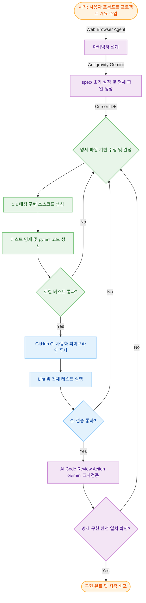

# py-template

이 프로젝트는 **의료 정보(Medical Information)를 다루는 파이썬(Python) 프로젝트에 적합한 로깅 시스템**을 기본으로 구현해 둔 공용 템플릿입니다. 의료 데이터의 특수성(보안, 감사 추적 등)을 충족하기 위한 정책과 인프라 구조를 내장하고 있습니다.

## AI Native Spec-Driven Development (AI 주도 명세 기반 개발)

본 프로젝트는 기획부터 배포까지 AI 에이전트와의 적극적인 협업을 통해 높은 품질과 생산성을 보장하는 **AI Native Spec-Driven Development** 워크플로우를 채택하고 있습니다. 명세(`.spec/`)를 중심으로 구현과 검증이 순환하는 자동화된 파이프라인이 매력적인 개발 경험을 제공합니다.

### 개발 워크플로우

이 템플릿 기반의 프로젝트는 다음과 같은 강력한 AI 검증 루프를 따릅니다:



1. **AI 기획 및 설계 (AI Planning)**: 사용자 프롬프트를 바탕으로 Web Browser 에이전트를 활용해 구체적인 아키텍처를 우선 설계합니다. 이후 안티그래비티(Gemini) 에이전트에게 설계된 아키텍처를 전달하여 `.spec/` 디렉터리 하위의 구조와 초안 명세 파일들을 생성합니다. (이때 Gemini에게 주입하는 프롬프트 예시는 [`documents/AI_NATIVE_ARCHITECTURE_PROMPTS.md`](./documents/AI_NATIVE_ARCHITECTURE_PROMPTS.md)의 `# AI-Native Spec-Driven 아키텍처 초안 프롬프트 (py-template 전용)` 섹션을 참고하세요.)
2. **명세 주도 개발 (Spec-Driven with Cursor)**: 파생된 명세 파일을 Cursor IDE에 전달하여 사용자와 AI가 명세의 디테일을 완성합니다. 완성된 명세를 바탕으로 1:1로 매칭되는 실행 파일을 생성한 뒤, 이 실행 파일을 기반으로 pytest를 위한 테스트 명세 및 실제 테스트 코드를 작성합니다. 테스트를 통과해야만 명세에 대한 구현 파일이 올바르게 만들어진 것으로 간주합니다.
3. **CI 검증 & AI 교차 리뷰 (CI & AI Review)**: 모든 실행 파일 개발이 완료되어 GitHub에 코드가 푸시되면, CI 파이프라인에서 Lint 등 가능한 모든 테스트가 진행됩니다. 테스트 도중 오류가 발견되면 **해당 명세 파일부터 찾아 추적 & 수정**하여 전체 사이클을 다시 반복합니다. 모든 CI 테스트를 통과하면 마지막으로 **CI Action Workflow 내의 AI Review(Gemini 모델 지정)** 동작을 통해 명세와 실행 파일이 애초의 계획과 의도대로 정확히 짝지어 작성되었는지 교차 검증을 수행합니다.

---

## 포함된 기능

### 환경 및 구조
- **가상환경·패키지**: [uv](https://github.com/astral-sh/uv)를 사용하여 `pyproject.toml` + `uv.lock` 기반으로 관리. 일반적인 흐름은 `uv venv .venv` → `uv sync`.
- **임포트 경로**: `src/common`과 `src/adapters`를 정식 패키지로 선언하여 어디서든 `import common.logger`, `import adapters.database` 등과 같이 사용.
- **환경 변수**: `.env` 기반. `make env`로 `.env.example` → `.env` 생성. `python-dotenv` 로드.

### 코드 품질 및 테스트
- **린터·포매터**: [ruff](https://docs.astral.sh/ruff/) — `make lint`, `make format`
- **타입 검사**: [mypy](https://mypy-lang.org/) — `make typecheck`
- **커밋 전 검사**: [pre-commit](https://pre-commit.com/) — ruff + mypy 자동 실행
- **테스트**: [pytest](https://docs.pytest.org/) — `make test` (unit / integration / e2e 구분)
- **GS 인증 산출물**: `make report` — HTML 테스트 리포트, 커버리지 리포트, Allure 결과, JUnit XML 자동 생성
- **CI/CD**: GitHub Actions — lint, typecheck, 멀티 OS(ubuntu/windows) 테스트, 산출물 Artifacts 업로드

### 로깅
- **로깅 시스템**: `config/logging.yml` + `.env`(`PROJECT_NAME`, `LOG_PATH`, `LOG_LEVEL`) 기반.
- **로그 경로**: `{PROJECT_ROOT}/logs` 또는 `.env`의 `LOG_PATH`(예: `/var/log/{PROJECT_NAME}`).
- **기능**: 콘솔/파일(service·audit 분리), JSON 포맷, 환경변수 치환, audit 전용 파일·stdout 미출력 정책.

### 핵심 유틸 (`src/common/`)
- **YAML 설정**: `common.load_config` — YAML 로드 + `${VAR}` 환경변수 치환.
- **환경변수 확장**: `common.expand_vars` — 문자열/딕셔너리/리스트 재귀 확장 (${VAR} → 값).

### 외부 연동 어댑터 (`src/adapters/`)
- **DB 연동**: `adapters.database` — PostgreSQL(psycopg2), `.env` 기반 연결·쿼리 헬퍼. (`uv sync --extra db`)
- **엑셀 입출력**: `adapters.excel_io` — 폴더 단위 xls/xlsx 읽기·쓰기, pandas 기반. (`uv sync --extra excel`)
- **암호화**: `adapters.get_cipher` — FF3(Format Preserving Encryption), `.env` 키/트웨이크/알파벳. (`uv sync --extra cipher`)

### 템플릿 업데이트 (파생 프로젝트용)

이 템플릿에서 **Use this template** 등으로 파생 프로젝트를 만든 뒤, 템플릿이 갱신되었을 때 **파생 프로젝트는 유지하면서 변경분만 반영**하려면 **Git merge**를 사용한다.

1. 파생 프로젝트 저장소에서 템플릿을 remote로 추가 (최초 1회):
   ```bash
   git remote add template https://github.com/사용자/py-template.git
   ```
2. 템플릿 업데이트 반영:
   ```bash
   git fetch template
   git merge template/main
   ```
   충돌이 나면 프로젝트 쪽 수정을 유지하면서 템플릿 변경만 선택적으로 반영하면 된다.

## 시스템 사양 및 전제조건

### 1. 지원 운영체제 (Supported OS)
본 템플릿은 크로스 플랫폼(Windows, Linux, macOS)을 지원합니다.
*   **테스트 환경**: **Windows 10/11 (WSL2 권장)**
    *   Windows 환경에서는 최적의 개발 경험을 위해 `wsl --install` 명령어로 **WSL2(Ubuntu)**를 활성화하여 가상 리눅스 환경에서 사용하시기를 강력히 권장합니다.
*   **CI 검증 (상시)**: GitHub Actions를 통해 **Ubuntu** 및 **Windows Server** 환경에서 코드 안정성을 검증합니다.
    *   *참고: macOS 검증은 기술적으로 지원 가능하나, CI 실행 비용 및 속도 효율을 고려하여 현재는 제외 상태입니다.*

### 2. 필수 설치 도구 (Prerequisites)
프로젝트 시작 전, 터미널에서 아래 명령어를 복사하여 필요한 도구를 설치하세요.

#### ① Windows 사용자용: 패키지 매니저 (Scoop) 설치
Windows 환경에서는 `make` 및 `git`을 간편하게 관리하기 위해 **[Scoop](https://scoop.sh/)** 사용을 권장합니다. PowerShell에서 아래 명령어로 Scoop을 먼저 설치하세요.
```powershell
# Scoop 설치 (PowerShell)
Set-ExecutionPolicy -ExecutionPolicy RemoteSigned -Scope CurrentUser
irm get.scoop.sh | iex
```

#### ② uv 설치 (패키지 및 Python 런타임 관리)
이 프로젝트는 Python 설치를 직접 하지 않고 `uv`를 통해 관리합니다.
*   **Windows (PowerShell)**:
    ```powershell
    powershell -ExecutionPolicy ByPass -c "irm https://astral.sh/uv/install.ps1 | iex"
    ```
*   **Linux & WSL2 / macOS (Bash)**:
    ```bash
    curl -LsSf https://astral.sh/uv/install.sh | sh
    ```

#### ③ GNU Make 및 Git 설치
자동화 명령어(`make`)와 버전 관리(`git`)를 위해 필요합니다.
*   **Windows (Scoop)**:
    ```powershell
    scoop install make git
    ```
*   **Linux & WSL2 (Ubuntu)**:
    ```bash
    sudo apt update && sudo apt install make git -y
    ```
*   **macOS (Homebrew)**:
    ```bash
    brew install make git
    ```

### 3. Python 버전 관리
**시스템에 Python을 따로 설치할 필요가 없습니다.**
본 프로젝트에서 `uv sync` 등의 명령을 실행하면, **`uv`가 `pyproject.toml`에 명시된 요구 버전에 맞는 Python을 자동으로 다운로드**하여 프로젝트 전용 가상환경(`.venv`)을 구성합니다.

## 빠른 시작

1. **가상환경 생성 및 의존성 설치(uv)**
   ```bash
   uv venv .venv
   source .venv/bin/activate   # Linux/macOS
   uv sync --group dev --extra all
   ```
2. **환경 변수 로드용 .env 준비**
   - 표준: `cp .env.example .env` 후 값 수동 편집.
   - 편의: `make env` — .env 생성 및 프로젝트명·경로·OS별 LOG_PATH 자동 치환.
   ```bash
   make env
   ```
3. **로그 디렉터리 생성** (필요 시)
   ```bash
   make logs
   ```

## 프로젝트 구조

| 경로 | 설명 |
|------|------|
| `src/common/` | 핵심 유틸리티 (logger, expand_vars, load_config) |
| `src/adapters/` | 외부 시스템 연동 (database, excel_io, get_cipher) |
| `scripts/setup/` | 환경 설정, 로그 디렉터리 등 자동화 스크립트 |
| `config/` | 로깅 설정 등 (`config/logging.yml`) |
| `tests/unit/` | 단위 테스트 |
| `tests/integration/` | 통합 테스트 (DB, 파일 등 외부 자원) |
| `tests/e2e/` | 종단 간 테스트 (사용자 시나리오) |
| `.github/workflows/` | CI/CD 파이프라인 (GitHub Actions) |

## Makefile 타깃

현재 `Makefile`은 `uv run` 기반의 복잡한 명령어를 래핑하여 개발 편의성을 높이기 위한 유틸리티로 제공됩니다.

| 타깃 | 설명 |
|------|------|
| `env` | `.env` 기반 환경 변수 복사 및 자동 구성 (`scripts/setup/setup_env.py`) |
| `logs` | OS 환경에 맞는 로그 디렉터리 자동 생성 (`scripts/setup/setup_log_dir.py`) |
| `setup` | `env` + `logs` 일괄 실행 |
| `test` | 로컬 환경 전체 테스트 실행 (`local_only` 마커 포함) |
| `test-fast` | CI 환경 기준 빠른 테스트 실행 (`local_only` 제외) |
| `lint` | ruff 린트 검사 |
| `format` | ruff 자동 포매팅 |
| `typecheck` | mypy 타입 검사 |
| `report` | GS 인증 산출물 생성 (HTML 리포트, 커버리지, Allure, JUnit) |

## GS 인증 테스트 마커

테스트 코드에 GS 인증 요구사항을 매핑할 수 있습니다:

```python
import pytest

@pytest.mark.gs_req("GS-31")
@pytest.mark.isms("ISMS-2.7-46")
def test_something():
    ...
```

사용 가능한 마커:
- `@pytest.mark.gs_req("GS-NN")` — GS 체크리스트 항목 ID (구분은 GS인증기준.md에서 조회)
- `@pytest.mark.isms("ISMS-2.x-NN")` — ISMS-P 체크리스트 항목 ID
- `@pytest.mark.integration` — 통합 테스트
- `@pytest.mark.e2e` — 종단 간 테스트
- `@pytest.mark.local_only` — 로컬 전용 (CI에서는 `pytest -m "not local_only"`로 제외)

**태그로 테스트 실행하기** (예: 특정 기준만 실행, local_only 제외): `documents/TAG_USAGE_GUIDE.md` 참고.

산출물 생성:
```bash
make report    # reports/ 디렉터리에 전체 산출물 생성
```

생성되는 파일:
| 파일 | 설명 |
|------|------|
| `reports/test_report.html` | pytest-html 테스트 결과 보고서 |
| `reports/coverage/` | 라인 단위 코드 커버리지 (HTML) |
| `reports/junit.xml` | JUnit XML (CI 연동용) |
| `reports/allure-results/` | Allure 대시보드 데이터 |

## 참고 문서

| 문서 | 설명 |
|------|------|
| `documents/TAG_USAGE_GUIDE.md` | pytest 마커(태그)로 테스트 실행·필터링 |
| `documents/GIT_TAGS_AND_RELEASES.md` | **Git 태그**와 GitHub Release 버전 관리 |
